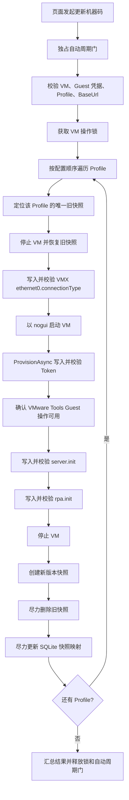

# 更新机器码流程说明

## 1. 功能目标

“更新机器码”会依次处理指定 VM 的全部 Profile 快照。每个 Profile 恢复原快照后先更新 VMX 网络类型，再启动 Guest 更新三项运行配置，最后关机并创建新版本快照：

| 配置 | Guest 固定路径 | 写入内容 |
| --- | --- | --- |
| 调度 Token | `D:\seebon\rpa\application.properties` | 更新或追加 `rpa.token=<Scheduler Token>` |
| 服务地址 | `C:\Program Files\rpa\server.init` | `Scheduler.BaseUrl` |
| 机器码 | `C:\Program Files\rpa\rpa.init` | VM 配置的 `WorkerId` |

另外会将 `Vmrun.NetType` 写入 VMX：

```ini
ethernet0.connectionType = "nat"
```

允许的 `NetType` 为 `nat`、`bridged`、`hostonly`、`custom`，默认值为 `nat`。

Token 写入复用 `IGuestTokenProvisioningService.ProvisionAsync`。服务地址和机器码使用相同的文本文件写入、回读校验及文件占用降级逻辑。

主要实现：

```text
Core/Operations/OperationsApiExtensions.cs
Core/Snapshot/InitFileUpdateService.cs
Core/Guest/GuestTokenProvisioningService.cs
Core/Snapshot/ProfileSnapshotResolver.cs
Core/Snapshot/SnapshotNameGenerator.cs
Core/Coordination/AutomaticCycleGate.cs
Core/Vmware/VmOperationLock.cs
Core/Vmware/VmrunService.cs
```

## 2. API 与并发保护

页面调用：

```http
POST /operations/vms/{vmName}/update-init-workerid
```

人工更新期间：

1. `IAutomaticCycleGate` 暂停“健康检查 + 自动快照调度”整个自动周期。
2. `IVmOperationLock` 锁定当前 `VmxPath`，避免同一进程内对该 VM 同时执行其他快照维护。
3. `VmrunService` 将本进程内所有 `vmrun.exe` 命令全局串行化。

该流程没有持久化维护事务；Agent 异常退出后，进程内门控和锁都会消失。

## 3. 前置校验

开始处理前校验：

- VM 必须存在，否则返回 `VM_NOT_FOUND`。
- `GuestUser` 必须配置，否则返回 `GUEST_CREDENTIALS_MISSING`。
- VM 至少包含一个 Profile，否则返回 `NO_PROFILES`。
- `Scheduler.BaseUrl` 必须配置，否则返回 `SCHEDULER_BASE_URL_MISSING`。
- `Vmrun.NetType` 必须是 `nat`、`bridged`、`hostonly` 或 `custom`。

`BaseUrl` 写入前会去除首尾空白，不改变地址内部内容。

## 4. 总体流程



单个 Profile 失败不会阻止后续 Profile 继续尝试；请求取消则终止后续处理并释放锁。

## 5. 单个 Profile 处理细节

### 5.1 快照恢复与启动

`ProfileSnapshotResolver` 从实际快照列表中查找唯一符合以下规则的快照：

```text
{ProfileId}.v{yyMMdd}.{sequence}
```

匹配缺失或重复均返回 `SNAPSHOT_NOT_FOUND`。找到后先执行安全关机并恢复快照。由于快照恢复可能同时恢复旧的虚拟硬件设置，服务会在恢复成功后、启动前修改 VMX：

```ini
ethernet0.connectionType = "<Vmrun.NetType>"
```

写入使用同目录临时文件原子替换，保留原文件编码，写入失败最多重试 5 次，并在完成后回读校验。失败返回 `WRITE_VMX_NETWORK_FAILED`，且不会启动 VM。

网络配置确认成功后使用后台模式启动：

```text
vmrun -T ws revertToSnapshot <vmx> <oldSnapshotName>
vmrun -T ws start <vmx> nogui
```

### 5.2 写入 Token

`GuestTokenProvisioningService.ProvisionAsync` 等待 Guest 操作可用，从 Scheduler Token Provider 获取 Token，然后更新固定文件：

```text
D:\seebon\rpa\application.properties
```

处理规则：存在 `rpa.token` 时替换，不存在时追加；完成后重新读取并校验。此路径不再由 `GuestWorkPath` 推导。

失败时尽力停止 VM，并将 Token 服务的错误码（例如 `CONFIG_UPDATE_FAILED`、`SCHEDULER_UNAVAILABLE`）写入当前 Profile 结果。

### 5.3 写入服务地址和机器码

Token 写入后，主流程再次确认 VMware Tools Guest 操作可用，然后依次写入：

```text
C:\Program Files\rpa\server.init  <- Scheduler.BaseUrl
C:\Program Files\rpa\rpa.init     <- WorkerId
```

两个文件均采用 UTF-8 写入，并立即按 UTF-8 回读；去除文件末尾换行后必须与期望值完全一致。

首次直接写入失败时执行统一降级流程：

1. 尽力执行 `taskkill /F /IM robot.exe`。
2. 等待 `robot.exe` 退出。
3. 写入同目录临时文件。
4. 使用 `Move-Item -Force` 替换目标文件。
5. 再次回读校验。

`server.init` 两次写入均失败返回 `WRITE_SERVER_INIT_FAILED`；`rpa.init` 两次写入均失败返回 `WRITE_INIT_FAILED`。失败后会尽力停止 VM，不会创建该 Profile 的新快照。

### 5.4 重建快照

三项 Guest 配置全部写入成功后停止 VM，并创建新快照：

```text
{ProfileId}.v{UTC日期yyMMdd}.{当日最大序号+1}
```

新快照创建成功后，旧快照删除和 SQLite Profile 映射更新均为 best-effort：异常只记录 Warning，不改变当前 Profile 的成功结果。全部 Profile 处理完成后 VM 保持关机。

## 6. 主要错误码

| 错误码 | 触发条件 |
| --- | --- |
| `VM_NOT_FOUND` | 找不到 VM |
| `GUEST_CREDENTIALS_MISSING` | 未配置 Guest 用户 |
| `NO_PROFILES` | VM 没有 Profile |
| `SCHEDULER_BASE_URL_MISSING` | 未配置 `Scheduler.BaseUrl` |
| `LIST_SNAPSHOTS_FAILED` | 无法读取快照列表 |
| `SNAPSHOT_NOT_FOUND` | Profile 快照缺失或重复 |
| `SNAPSHOT_REVERT_FAILED` | 恢复旧快照失败 |
| `WRITE_VMX_NETWORK_FAILED` | 无法写入或校验 `ethernet0.connectionType` |
| `VM_START_FAILED` | `vmrun start ... nogui` 失败 |
| `GUEST_OPERATIONS_TIMEOUT` | VMware Tools Guest 操作超时 |
| `WRITE_SERVER_INIT_FAILED` | `server.init` 写入或校验失败 |
| `WRITE_INIT_FAILED` | `rpa.init` 写入或校验失败 |
| `SNAPSHOT_CREATE_FAILED` | 新快照创建失败 |
| `PARTIAL_FAILURE` | 至少一个 Profile 失败 |

## 7. 验证与运维检查

自动测试覆盖完整成功路径，验证恢复快照后先把 VMX 从 bridged 改为配置的 nat，再启动 VM、写入 Token、BaseUrl 和 WorkerId，最后创建新快照并删除旧快照。

上线前应确认：

- `Scheduler.BaseUrl` 是 Guest 实际可访问的地址。
- `Vmrun.NetType` 与部署环境期望的 VMware 网络类型一致。
- Scheduler Token 接口可用。
- Guest 凭据有效且 VMware Tools 可以执行 Guest 命令。
- Guest 中 `D:` 盘及上述三个目标目录存在且可写。
- 每个 Profile 只有一个符合命名规则的快照。
- VM 存储目录有足够空间创建新快照。

执行后建议从新快照启动抽查：

- `application.properties` 中 `rpa.token` 已更新。
- `.vmx` 中 `ethernet0.connectionType` 等于 `Vmrun.NetType`。
- `server.init` 等于配置的 `Scheduler.BaseUrl`。
- `rpa.init` 等于 VM 配置的 `WorkerId`。
- Runner 能连接正确服务并正常响应。

## 8. 已知限制

- 安全关机的 hard stop 失败后缺少最终电源状态确认。
- 启动步骤只执行一次 `StartVmAsync`，未复用带重试和运行状态确认的开机恢复流程。
- 旧快照删除或 SQLite 映射更新失败仍会报告 Profile 成功，可能给下一次维护留下重复快照或陈旧映射。
- 当前只有进程内锁，没有可在 Agent 重启后恢复的持久化维护事务。
- 成功路径已有专项测试；文件占用降级、各步骤失败、请求取消等路径仍需继续补充测试。
